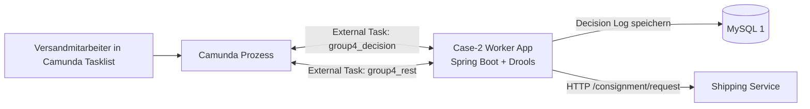

# Case 2 Lösungsdokumentation

Moderator: Roberto Panizza

Autoren: Roberto Panizza, Loris Trifoglio

## Abgabe

Unsere geplante Abgabe für Case 2 besteht aus:

- angepasstem BPMN-Prozess auf Basis von `case1/case1.bpmn`
- Spring-Boot-App mit zwei External-Task-Workern für Versandentscheidung und Speditionsaufruf
- Drools-Decision-Table für die bekannten Versandregeln
- Protokollierung der Entscheidungen in `MySQL 1`
- kurze Monitoring-Konzeptbeschreibung für die spätere Erweiterung
- Dokumentation der Architektur und des Umsetzungsplans

## Ausgangslage und Randbedingungen

Case 2 baut direkt auf dem teilautomatisierten Versandprozess aus Case 1 auf. In Case 1 wird der Versandauftrag in Camunda orchestriert und der bestehende Shipping Service über einen External Task angebunden. Der in Case 2 adressierte manuelle Teil ist die fachliche Versandentscheidung, die laut Ausgangslage derzeit als undokumentierte Ergänzung von Schritt 2 erfolgt.

Die Problemstellung aus `Case 2 Ausgangslage.pdf` verlangt:

- Automatisierung der einfachen, bekannten Versandregeln
- klare Trennung der Verantwortlichkeiten für spätere Erweiterbarkeit
- Vorbereitung auf eine spätere AI-gestützte Entscheidungslogik
- Protokollierung der Entscheidungen
- Berücksichtigung eines späteren Monitorings

## Verfügbare Systeme laut System Overview


Für Case 2 stehen im vorhandenen Setup konkret die folgenden Systeme zur Verfügung:

- `Camunda`
- `Shipping Service`
- `MySQL 1`

Nicht als verfügbare Infrastruktur für Case 2 sichtbar sind:

- dedizierte Business-Rule-Infrastruktur
- Prometheus / Grafana
- weitere Versandprovider-Services

Daraus folgt für die Zielarchitektur:

- die Rule Engine muss als eigene fachliche Komponente innerhalb der Case-2-Lösung bereitgestellt werden
- die Entscheidungsprotokollierung soll auf `MySQL 1` erfolgen
- Monitoring wird nur vorbereitet, aber nicht als eigene Plattform umgesetzt
- die bestehende Shipping-API bleibt bestehen und wird durch einen in `case2` integrierten Worker auf Topic `group4_rest` genutzt, wenn die Regelentscheidung eine automatische Weiterverarbeitung erlaubt

## Lernfragen und Entscheidungen

### 1. Wo wird die Fachentscheidung platziert?

Nicht in Camunda selbst. Camunda bleibt für Orchestrierung und Prozesszustand zuständig. Die Versandentscheidung wird in eine eigene Spring-Boot-Komponente ausgelagert. Dadurch bleibt die Entscheidungslogik austauschbar und später durch AI ersetzbar oder ergänzbar.

### 2. Warum Drools und nicht reine BPMN-Gateways?

Die Regeln sind fachlich volatil und sollen später wachsen. Eine tabellenbasierte Rule Engine ist für diesen Anwendungsfall besser wartbar als eine stetig wachsende Menge an BPMN-Ausdrücken. BPMN soll nur das Prozessrouting abbilden, nicht die komplette Fachlogik.

### 3. Wo wird protokolliert?

In `MySQL 1`, weil dieses System im Case-1/2-Bereich laut System Overview bereits vorhanden ist. Damit gibt es eine persistente Audit-Spur für spätere Analyse, Nachvollziehbarkeit und AI-Training.

### 4. Wie wird Monitoring berücksichtigt?

Da keine Monitoring-Plattform im Bild für Case 2 vorhanden ist, wird nur die technische Anschlussfähigkeit vorbereitet:

- Spring Boot Actuator
- strukturierte Logs mit Decision ID und Order ID
- persistente Entscheidungsprotokolle in MySQL

Später kann darauf Prometheus/Grafana aufsetzen, ohne die Fachlogik neu schneiden zu müssen.

## Zielarchitektur

### High-Level



### Verantwortung pro Komponente

- `Camunda`
  - Orchestrierung des Gesamtprozesses
  - Benutzerinteraktion über Forms
  - Routing zwischen automatisiertem und manuellem Pfad

- `Case-2 Worker App`
  - Auswertung der Versandregeln
  - Kapselung der Rule Engine
  - Abholung und Bearbeitung beider Camunda External Tasks (`group4_decision` und `group4_rest`)
  - Persistente Protokollierung der Entscheidung

- `MySQL 1`
  - Audit-Log aller Entscheidungen
  - Grundlage für spätere Auswertung und AI-Training

- `Shipping Service`
  - bleibt unverändert aus Case 1 bestehen
  - wird nur für automatisch freigegebene Standard-Speditionsfälle genutzt

## Fachlicher Entscheidungsfluss

Der Prozess für Case 2 soll wie folgt erweitert werden:

1. Benutzer erfasst bzw. ergänzt die Versanddaten in Camunda.
2. Camunda erzeugt einen External Task `Versandentscheidung ermitteln`.
3. Der `Decision Worker` holt den Task ab und wertet die Regeln mit Drools aus.
4. Die Entscheidung wird inklusive Eingabedaten, Regel-ID und Begründung in `MySQL 1` protokolliert.
5. Camunda verzweigt anhand des Rückgabewerts:
   - `STANDARD_SPEDITION_AUTOMATED`: Weiter mit `Spedition beauftragen` (Topic `group4_rest`, verarbeitet von derselben Case-2-App)
   - `MANUAL_REVIEW_REQUIRED`: manuelle Bearbeitung mit Entscheidungshinweis

Wichtig: Da im System Overview für Case 2 nur der bestehende `Shipping Service` sichtbar ist, wird ausschließlich der Standard-Speditionspfad vollautomatisch weitergeführt. Andere erkannte Fälle werden fachlich korrekt klassifiziert, aber in einen manuellen Bearbeitungsschritt übergeben, solange kein weiterer Provider-Service verfügbar ist.

## Konkrete Case-2-Regelstrategie

### Bekannte Regeln aus der Aufgabenstellung

- Argentinien, Gewicht zwischen 60kg und 500kg:
  - spezielle Spedition
- Argentinien, kleiner als 60kg:
  - normale Post
- Argentinien, größer als 500kg:
  - manuelle Behandlung
- Japan bis 200kg:
  - Luftfracht
- Russische Föderation:
  - manuelle Prüfung wegen Sanktionen
- Schweiz und Deutschland:
  - normale Spedition

### Operative Übersetzung für die vorhandene Umgebung

| Land / Bedingung | Entscheidungsresultat | Automatisch weiter? | Begründung |
|---|---|---:|---|
| Schweiz oder Deutschland | `STANDARD_SPEDITION_AUTOMATED` | Ja | vorhandener Shipping Service kann genutzt werden |
| Russische Föderation | `MANUAL_REVIEW_REQUIRED` | Nein | Sanktionsprüfung notwendig |
| Argentinien < 60kg | `MANUAL_REVIEW_REQUIRED` | Nein | Post-Schnittstelle nicht vorhanden |
| Argentinien 60kg bis 500kg | `MANUAL_REVIEW_REQUIRED` | Nein | Spezialspedition nicht vorhanden |
| Argentinien > 500kg | `MANUAL_REVIEW_REQUIRED` | Nein | explizit fallspezifisch |
| Japan <= 200kg | `MANUAL_REVIEW_REQUIRED` | Nein | Luftfracht-Schnittstelle nicht vorhanden |
| sonst | `MANUAL_REVIEW_REQUIRED` | Nein | keine freigegebene Regel vorhanden |

Diese Übersetzung ist absichtlich konservativ. Sie automatisiert in der aktuellen Systemlandschaft nur die Fälle, für die bereits ein echter Ausführungspfad vorhanden ist.

## Rückgabevertrag des Decision Workers

Der Decision Worker benötigt als Camunda-Prozessvariablen mindestens:

```json
{
  "order_nr": "4711",
  "client_nr": "100023",
  "delivery_country": "CH",
  "delivery_address": "Musterstrasse 1, 4051 Basel",
  "weight": 120,
  "phone": "+41611234567",
  "mail": "kunde@example.org"
}
```

Er schreibt nach erfolgreicher Bearbeitung mindestens die folgenden Variablen zurück:

```json
{
  "decision_id": "0c5d1d4e-8f5b-4c4b-b7c0-5d73e98b8d29",
  "decision_outcome": "STANDARD_SPEDITION_AUTOMATED",
  "decision_auto_continue": true,
  "decision_recommended_channel": "STANDARD_SPEDITION",
  "decision_rule_id": "CH_DE_STANDARD_SPEDITION",
  "decision_rule_version": "v1",
  "decision_reason": "Lieferungen in die Schweiz und nach Deutschland werden über die normale Spedition abgewickelt."
}
```

### Prozessvariablen in Camunda

Der Decision Worker soll mindestens die folgenden Prozessvariablen für den weiteren Ablauf liefern:

- `decision_id`
- `decision_outcome`
- `decision_auto_continue`
- `decision_recommended_channel`
- `decision_rule_id`
- `decision_rule_version`
- `decision_reason`

## BPMN-Anpassungen gegenüber Case 1

Das bestehende Modell aus Case 1 wird nicht ersetzt, sondern gezielt erweitert.

### Neue oder angepasste Prozessdaten

- `delivery_country`
- `decision_*` Variablen gemäss Liste oben

Wichtig: `delivery_country` existiert in `case1` noch nicht. In [case1.bpmn](C:/Users/Loris/Github/it-architecture/case1/case1.bpmn) werden im zweiten Formular nur `delivery_address`, `phone` und `mail` erfasst. Für Case 2 muss das Land deshalb entweder als eigenes Feld erfasst oder aus der Adresse robust abgeleitet werden. Für eine verlässliche Regelverarbeitung ist ein explizites Feld `delivery_country` vorzuziehen.

### Neue Prozessschritte

1. Nach `Formular A38 mit weiteren Informationen ergänzen` wird ein neuer Service Task eingefügt:
   - `Versandentscheidung ermitteln`
2. Danach folgt ein Gateway:
   - `Automatische Weiterverarbeitung möglich?`
3. Nur bei `decision_auto_continue == true` geht es weiter zu:
   - `Spedition beauftragen`
4. Andernfalls führt der Prozess zu:
   - `Manuelle Versandentscheidung bearbeiten`
   - Anzeige von `decision_recommended_channel` und `decision_reason`

### Erwartete BPMN-Struktur

```text
Bearbeitung Kundenauftrag
  -> Formular A38 ergänzen
  -> Versandentscheidung ermitteln
  -> Gateway: decision_auto_continue?
     -> Ja: Spedition beauftragen -> Email -> Ablagefach P
     -> Nein: Manuelle Versandentscheidung -> ggf. Hotline / externe Bearbeitung -> Email -> Ablagefach P
```

## Interner Zuschnitt der Implementierung

Empfohlene Modulstruktur für `case2`:

```text
case2/
  src/main/java/.../api
  src/main/java/.../service
  src/main/java/.../rules
  src/main/java/.../persistence
  src/main/resources/rules/shipping-rules.drl
  src/main/resources/rules/shipping-rules.csv
```

### Kernklassen

- `ShippingDecisionService`
  - fachliche Orchestrierung der Entscheidung
- `DroolsRuleEvaluator`
  - Ausführung der Decision Table
- `DecisionExternalTaskWorker`
  - Camunda-External-Task-Integration für Topic `group4_decision`
- `SpeditionExternalTaskWorker`
  - Camunda-External-Task-Integration für Topic `group4_rest` und HTTP-Aufruf des Shipping Service
- `DecisionLogRepository`
  - Persistenz in MySQL 1 (Tabelle `shipping_decision_log`)

## Datenmodell für MySQL 1

Vorgeschlagene Tabelle `shipping_decision_log`:

| Feld | Typ | Zweck |
|---|---|---|
| `id` | UUID / VARCHAR(36) | technische Decision ID |
| `created_at` | TIMESTAMP | Zeitpunkt der Entscheidung |
| `order_nr` | VARCHAR | fachlicher Bezug |
| `client_nr` | VARCHAR | fachlicher Bezug |
| `delivery_country` | VARCHAR(2) | Regelinput |
| `delivery_address` | TEXT | Regelinput / Nachvollziehbarkeit |
| `weight_kg` | INT | Regelinput |
| `outcome` | VARCHAR | fachliches Resultat |
| `auto_continue` | BOOLEAN | Routing-Hinweis für BPMN |
| `recommended_channel` | VARCHAR | z. B. `STANDARD_SPEDITION` |
| `rule_id` | VARCHAR | getroffene Regel |
| `rule_version` | VARCHAR | Version der Tabelle |
| `reason` | TEXT | fachliche Begründung |
| `payload_json` | JSON oder TEXT | kompletter Input für spätere Analyse |

## Sicherheitsaspekt: SQL-Injection-Schutz

Die Persistenz wird in der Umsetzung ausschließlich über parametrisierte SQL-Statements realisiert:

- `DecisionLogRepository` verwendet ein `PreparedStatement` mit Platzhaltern (`?`) und typisierter Parameterbindung.
- Es wird keine SQL-String-Konkatenation mit Benutzereingaben durchgeführt.
- `payload_json` wird strukturiert per Jackson serialisiert und als Parameter gebunden.

## Monitoring-Konzept für die aktuelle Umgebung

Da im vorhandenen Setup für Case 2 keine dedizierte Monitoring-Infrastruktur sichtbar ist, wird für diesen Case nur die Anschlussfähigkeit geschaffen:

- `Spring Boot Actuator` aktivieren
- Health-Endpoint für Service und Datenbank
- strukturierte Logs mit `decisionId`, `orderNr`, `outcome`
- Metriken vorbereiten:
  - Anzahl Entscheidungen
  - Anteil automatische Weiterverarbeitung
  - Anteil manueller Fälle
  - Fehler bei Rule-Auswertung
  - Fehler bei Datenbankpersistenz

Später können diese Daten durch Prometheus/Grafana konsumiert werden, ohne dass sich die Kernarchitektur ändert.

## Konkreter Umsetzungsplan

### Arbeitspaket 1: Case-2-Projekt aufsetzen

- neues Spring-Boot-Projekt in `case2` anlegen
- Abhängigkeiten:
  - Spring Web
  - Spring JDBC
  - MySQL Driver
  - Drools
  - Actuator
- Basis-Config für `MySQL 1` und Logging

### Arbeitspaket 2: Decision API definieren

- Eingabe- und Ergebnisobjekte für die Regelentscheidung festlegen
- External-Task-Worker für Camunda implementieren
- Validierung für `delivery_country`, `weight` und Pflichtfelder

### Arbeitspaket 3: Drools-Regeln umsetzen

- ausführbare Drools-Regeln in `shipping-rules.drl` anlegen
- tabellarische Regelspezifikation in `shipping-rules.csv` pflegen
- Regeln mit den bekannten Fällen modellieren
- Versionierung der Regeln vorsehen
- Unit-Tests für jede Regelkombination schreiben

### Arbeitspaket 4: Entscheidungsprotokollierung implementieren

- JDBC-Repository (`DecisionLogRepository`) anlegen
- Migration oder initiales SQL für Tabelle `shipping_decision_log`
- Persistenz nach jeder erfolgreichen Regelentscheidung
- SQL-Injection-Schutz durch Prepared Statements und Parameterbindung

### Arbeitspaket 5: BPMN aus Case 1 erweitern

- neues BPMN für Case 2 ableiten
- External Service Task `Versandentscheidung ermitteln` einfügen
- Gateway für `decision_auto_continue`
- Formular A38 um `delivery_country` erweitern
- manuellen Task für nicht automatisch ausführbare Entscheide modellieren

### Arbeitspaket 6: Integration mit bestehendem Versandpfad

- nur für `STANDARD_SPEDITION_AUTOMATED` in den bestehenden Aufruf `Spedition beauftragen` verzweigen
- für alle anderen Fälle die empfohlene Versandart im manuellen Task anzeigen

### Arbeitspaket 7: Observability und Rest-Risiken

- Actuator-Endpunkte prüfen
- strukturierte Logs verifizieren
- dokumentieren, welche Fälle noch nicht vollautomatisiert sind, weil passende Provider-Schnittstellen fehlen

## Geplante Artefakte für die Abgabe

- `case2` Spring-Boot-Service
- `case2` BPMN-Datei
- Drools-Decision-Table
- SQL / JDBC für `shipping_decision_log`
- diese Lösungsdokumentation

## Fazit

Die konkrete Zielarchitektur für Case 2 ist:

- `Camunda` für Orchestrierung
- `Case-2 Worker-App` für Regelentscheidung, Speditionsaufruf und Protokollierung
- `MySQL 1` für Audit und spätere AI-Grundlage
- bestehender `Shipping Service` nur für Standard-Speditionsfälle

Damit wird die Fachentscheidung sauber vom Prozess getrennt, auf die vorhandene Umgebung Rücksicht genommen und ein belastbarer technischer Pfad für spätere Erweiterungen geschaffen.
